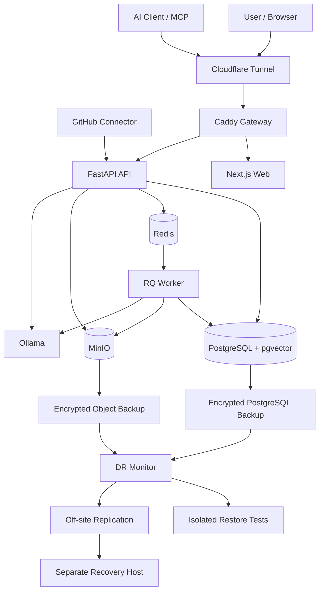

# Engram Engineering Portfolio

> A self-hosted personal knowledge and AI context platform built as a production-style platform engineering project.

Engram began as a personal memory API and evolved into a full-stack platform with
document ingestion, semantic retrieval, AI integrations, disaster recovery, automated
testing, controlled deployments and operational tooling.

The project is designed around one principle:

**Personal data should remain useful, portable, recoverable and under the owner's control.**

## Project snapshot

Engram includes:

- FastAPI backend
- Next.js web interface
- PostgreSQL with pgvector
- Redis and RQ background processing
- MinIO object storage
- Ollama for local AI workloads
- REST API and MCP support
- OAuth with PKCE
- GitHub ingestion
- browser capture
- encrypted PostgreSQL backups
- encrypted object-storage backups
- off-site backup replication
- automated disaster-recovery testing
- Docker Compose deployment
- GitHub Actions CI
- Dependabot dependency monitoring
- protected main branch and required CI checks

## Architecture



## Production engineering

The application is deployed as a multi-service Docker Compose stack.

Public traffic reaches only the Caddy gateway. PostgreSQL, Redis, MinIO and Ollama
remain on private Docker networks and are not directly exposed to the internet.

Production container dependencies are pinned to immutable image digests.

Application changes move through GitHub pull requests with required CI checks before
they can reach the protected `main` branch.

CI validates:

- Python application compilation
- backend tests
- PostgreSQL connectivity
- pgvector availability
- Redis connectivity
- frontend dependency installation
- Next.js production builds
- Docker Compose validity
- external production image availability
- application and operational container builds

## Disaster recovery

Engram does not treat the existence of a backup file as proof that recovery works.

The disaster-recovery system verifies encrypted backup artifacts and performs isolated
restore tests.

The restore workflow:

1. decrypts a PostgreSQL backup
2. creates a disposable PostgreSQL database
3. restores the database
4. validates the pgvector extension
5. counts restored memories and documents
6. decrypts and extracts the object-storage backup
7. checks every restored document object reference
8. records recovery evidence
9. removes the disposable database
10. removes temporary plaintext recovery data

Production data is not overwritten during the test.

## Proven recovery result

A full off-site recovery exercise was completed on 14 September 2026.

The test used real encrypted production backup artifacts replicated from the primary
Engram server to a separate recovery host.

```text
PostgreSQL restore:         PASS
pgvector validation:        PASS
Object archive extraction:  PASS

Memories restored:          672
Documents restored:         422
Object files restored:      422
Missing object references:  0

Restore duration:           17 seconds
```

This validated the complete recovery chain:

```text
Production
    |
    v
Encrypted backups
    |
    v
Off-site replication
    |
    v
Separate recovery host
    |
    v
Decrypt
    |
    v
Isolated database restore
    |
    v
pgvector validation
    |
    v
Object restore
    |
    v
Document/object consistency check
    |
    v
PASS
```

## Problems solved during hardening

### Fresh deployment depended on cached MinIO images

The existing production host continued to work because the required MinIO images were
already cached locally.

A clean deployment on a second machine revealed that the original Docker Hub image
references were no longer available.

The deployment was changed to use working MinIO Community images from Quay and pinned
to immutable digests.

This demonstrated why testing only an existing host is not sufficient proof of
repeatable deployment.

### Empty object storage broke backups

The object-backup job assumed that an `mc mirror` operation would always create the
destination directory.

With an empty MinIO bucket, no directory was created and `tar` subsequently failed.

The backup process was changed to explicitly create its staging directory before the
mirror operation.

The fix was validated against an empty MinIO deployment and produced a valid encrypted
backup.

### Database schema was missing from fresh installs

The Compose configuration referenced `db/init.sql`, but the global SQL ignore rule
prevented the bootstrap schema from being tracked.

This meant an existing deployment could work while a clean clone could not reproduce
the database correctly.

The bootstrap schema is now explicitly tracked and exercised by CI using a real
PostgreSQL + pgvector service.

### CI did not test real infrastructure dependencies

Initial backend CI concentrated on Python-level validation.

The pipeline was expanded to start PostgreSQL + pgvector and Redis services and perform
real connectivity and integration tests.

This catches configuration and infrastructure regressions that unit tests alone cannot.

### External container availability was not tested

The original Docker CI job built application containers but did not prove that external
runtime images were still available from their registries.

The v2.3.1 pipeline adds explicit pull validation for production runtime images.

This directly protects against the type of registry failure discovered during the clean
deployment exercise.

### Recovery had to be proven, not assumed

Encrypted backups and off-site copies existed, but that alone did not prove that they
could reconstruct Engram.

A recovery drill restored the real off-site backup pair onto a separate host.

The test restored 672 memories, 422 documents and 422 object files with zero missing
references.

## Engineering practices demonstrated

Engram demonstrates practical experience with:

- Linux server administration
- Docker and Docker Compose
- container networking
- FastAPI
- PostgreSQL
- pgvector
- Redis
- MinIO and S3-compatible object storage
- Next.js
- background job processing
- REST APIs
- MCP
- OAuth and PKCE
- local AI inference
- CI/CD
- GitHub Actions
- Dependabot
- branch protection
- immutable dependency pinning
- encrypted backups
- off-site replication
- disaster recovery
- recovery testing
- monitoring
- incident-style troubleshooting
- technical documentation

## Evidence gallery

Portfolio screenshots should be stored in:

```text
docs/images/portfolio/
```

Recommended evidence:

```text
01-dashboard.png
02-memory-search.png
03-document-ingestion.png
04-disaster-recovery-dashboard.png
05-dr-passed.png
06-github-actions-green.png
07-v231-release.png
08-docker-compose-production.png
09-health-v231.png
10-architecture.png
```

Screenshots should avoid exposing credentials, API keys, personal data, internal
documents or secret configuration.

## What this project demonstrates

Engram is not only an application implementation.

It demonstrates the lifecycle around operating software:

```text
Design
  |
Build
  |
Troubleshoot
  |
Test
  |
Automate
  |
Secure
  |
Document
  |
Deploy
  |
Monitor
  |
Back up
  |
Recover
  |
Prove
```

The v2.3.1 hardening cycle deliberately focused on repeatability and evidence rather
than adding new features.

The result is a system that can be rebuilt from source, validated automatically,
backed up securely and recovered from an off-site copy.
